# Smoke-Detection For Alysa
A smoke detector based on image and video.  
Early warning of fire disaster is one of the important usage of smoke detection.
Smoke detector which based on video or image can avoid interference of environmental especially in open or lager spaces and outdoor environments.Generally speaking, video based smoke detection methods distinguish smoke from non-smoke objects based on some distinctive features such as motion, edge, color and texture.
***
## Requirements
- Python3
- numpy
- sklearn
- skimage
- opencv
- TensorFlow
- Keras
***
## 烟雾数据集
本文中所使用数据集大部分为中科大火灾实验室所收集
- [包含1000张图片的图片数据集(test8)](http://smoke.ustc.edu.cn/datasets.htm)
- [袁飞牛组所收集数据集(smoke_data)](http://staff.ustc.edu.cn/~yfn/DNCNN_code.zip)
- [袁飞牛教授个人主页](http://staff.ustc.edu.cn/~yfn/index.html)
- [视频数据集](http://smoke.ustc.edu.cn/datasets.htm)  

由于中科大火灾实验室网站不稳定，因此将使用数据传到[百度云]()。
## 文中所使用算法
### HOG特征、LBP特征 + SVM分类器
- 文件名:Smoke_Detection_HOG_and_LBP_with_SVM  

使用skimage库中hog特征、lbp特征提取图片边缘、纹理特征，结合sklearn中的svm分类器进行分类。判断图片中是否包含烟雾  
计算结果如下所示：  
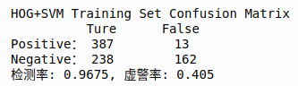
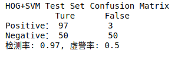
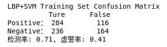
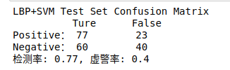

### 全连接神经网络 + SVM分类器
- 文件名:Smoke_Detection_with_One_Hidden_Layer  
使用tensorflow搭建一个具有单隐层的神经网络，提取图片深度特征，再结合svm进一步提高准确率  

### 使用VGG16迁移学习
- 文件名:Smoke_Detection_VGG16_with_SVM_and_Fully_Connected_Network  
使用在ImageNet上预训练的VGG16进行迁移学习，使用VGG16的卷积层作为特征提取器，SVM作为分类器/finetune最后的全连接层，作为烟雾检测  
计算结果如下所示：  
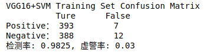
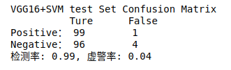
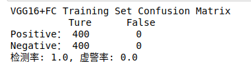
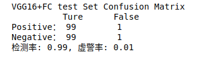

### 特征融合模型
- 文件名:smoke_detection_with_feature_fusion  
结合HOG特征、LBP特征和VGG16所`提取的深度特征进行烟雾检测  
网络结构图如下图所示  
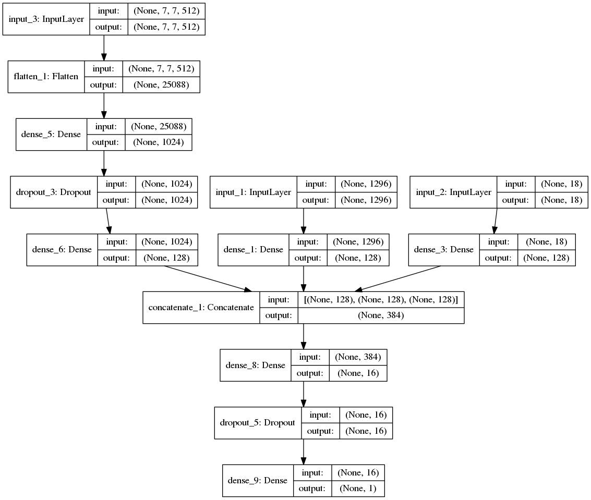
其中input1为hog特征，input2为lbp直方图特征、input3为VGG16深度特征，将三个特征均压缩为128维后进行拼接，然后再输入到一个全连接神经网络中进行分类。  
计算结果如下图所示：  
- HOG  
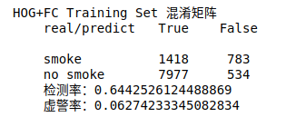
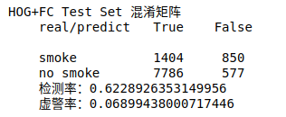
- LBP  
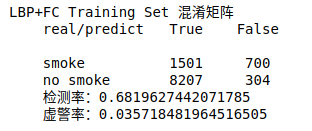
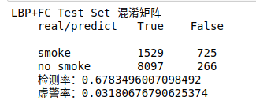
- VGG16  
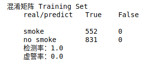
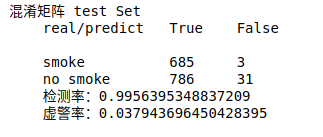
- 最终结果  
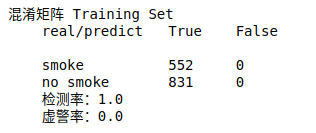
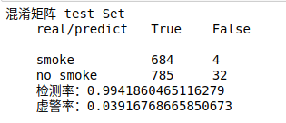
### 将烟雾检测模型用于树莓派  
- 文件名:Smoke_Detection_MobileNet  
- 文件名:raspberry_pi  
使用MobileNet模型，在电脑上进行FineTune并保存模型，在树莓派上直接读取训练好的模型参数  
计算结果如下所示：  
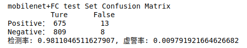

## 其他程序
### HOG/LBP特征可视化  
- 文件名:show_hog_lbp_feature_map    
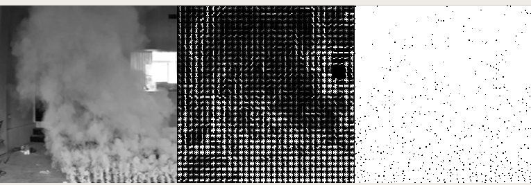
### 爬虫
- 文件名:spider  
使用requests和bs4库从百度图片爬取制定关键字图片作为数据集

## 使用方法  
安装所需库，将数据集文件夹和py代码放如同一目录下python xxx.py即可运行
```
+-- smoke_detection
|   +-- smoke_dataset
|       +--set1_48_data.npy
|       +--set1_48_label.npy
|       +--set2_48_data.npy
|       +--set2_48_label.npy
|       +--set3_48_data.npy
|       +--set3_48_label.npy
|       +--set4_48_data.npy
|       +--set4_48_label.npy
|   +-- test8
|       +--000001.png
|       +--000002.png
|       +--...
|   +-- Smoke_Detection_xxx.py
```
